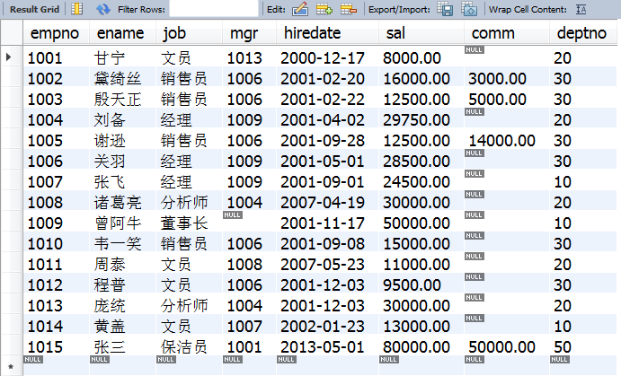

# 课堂用于MySQL数据库的数据
## 第一张表
    单行文本实验
### test
```c
  #include<stdio.h>
  int main(){
  
  return 0;
  }
```

# 这是一次实验




**这是直接的文字**


```js
    function fun(){
         echo "这是一句非常牛逼的代码";
    }
    fun();
```
## 这是第二次实验
